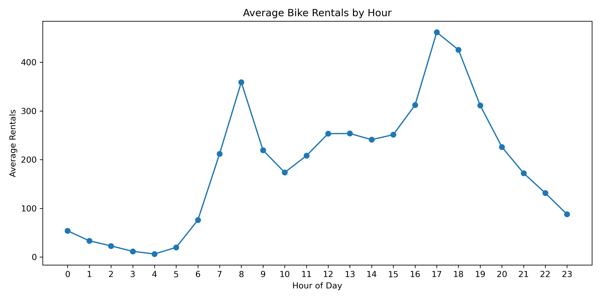
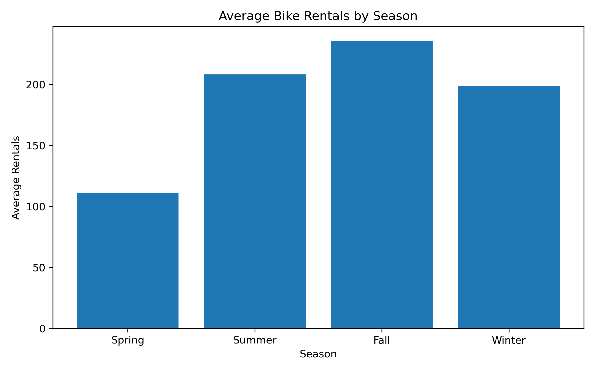
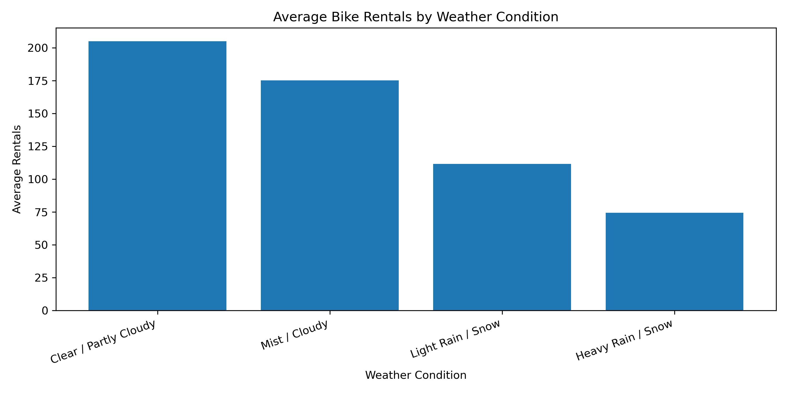
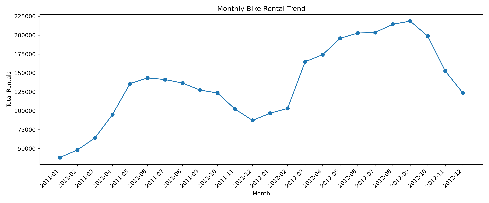
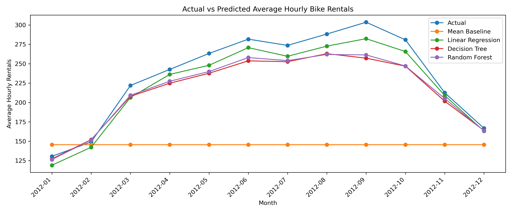
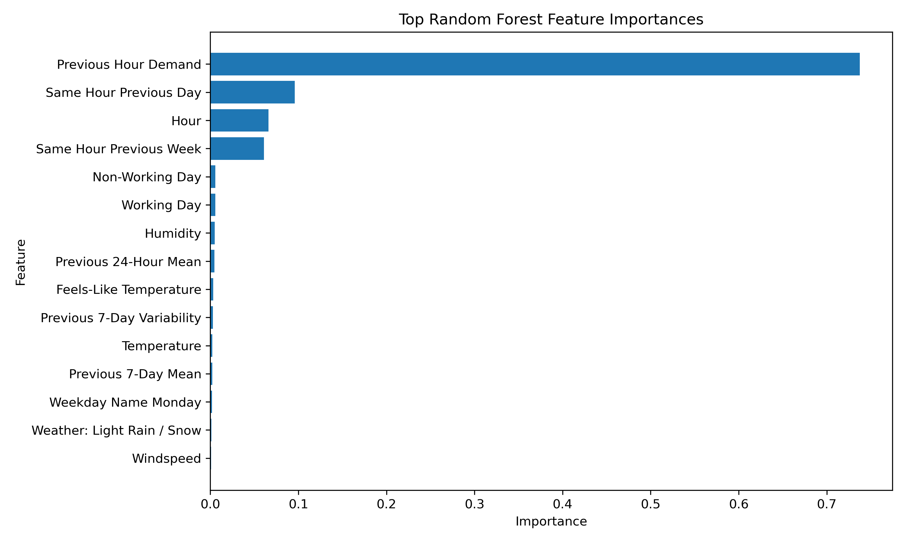

# 🚲 Bike Sharing Demand Analysis

A complete end-to-end data project demonstrating how feature engineering, SQL analysis, machine learning, and business intelligence can be combined to understand and predict bike rental demand.

---

## 📌 Project Overview

This project analyzes and predicts bike rental demand using an integrated workflow built on:

- Python (Pandas, NumPy, Matplotlib)
- SQL (SQLite)
- Machine Learning (Scikit-learn)
- Business Intelligence (Power BI)

The focus is on uncovering temporal demand patterns and improving predictive performance through time-based feature engineering and interpretable modeling.

---

## 📊 Key Components

### 🔹 1. Data Cleaning
- Processed raw hourly bike rental data
- Standardized and renamed columns for clarity
- Created categorical variables:
  - Season
  - Weather condition
  - Day type (working vs non-working)
- Engineered additional time-based features (month, weekday, etc.)

---

### 🔹 2. Exploratory Data Analysis
Analyzed demand patterns across key dimensions:

- Hour of Day → strong morning and evening commute peaks  
- Season → highest demand in fall, lowest in spring  
- Weather → highest usage in clear conditions  
- Working vs Non-Working Days → slightly higher weekday demand  

Visualizations include:
- Line plots  
- Bar charts  
- Heatmaps  
- Scatter plots  

---

### 🔹 3. Machine Learning

#### Models Implemented:
- Linear Regression  
- Decision Tree Regressor  
- Random Forest Regressor  
- Mean Baseline (benchmark)  

#### Feature Engineering:
- Lag features:
  - Previous hour  
  - Same hour previous day  
  - Same hour previous week  
- Rolling statistics:
  - 24-hour average  
  - 7-day average  
  - 7-day variability  

#### Evaluation Metrics:
- RMSE (Root Mean Squared Error)  
- MAE (Mean Absolute Error)  
- R² (Coefficient of Determination)  

---

### 🔹 4. SQL Analysis
- Built a SQLite database from cleaned data  
- Performed analytical queries for:
  - Rentals by hour  
  - Rentals by season  
  - Rentals by weather  
  - Working vs non-working demand  
  - Monthly trends  
  - Top demand periods  

---

### 🔹 5. Power BI Dashboard

Interactive dashboard includes:

- Demand Overview
- Monthly Trends
- Model Performance Comparison
- Feature Importance Analysis
- Drillthrough Page (Season-Level Analysis)

---

## 📈 Key Insights

- Bike rental demand is highly time-dependent
- Lag features dominate both correlation and model importance
- Weather impacts demand but plays a secondary role
- Linear Regression achieved the best performance after feature engineering
- Demand exhibits strong daily and weekly cyclical patterns

---

## 🛠️ Tech Stack

- Python: Pandas, NumPy, Matplotlib, Scikit-learn  
- SQL: SQLite  
- BI Tool: Power BI  

---

## 📂 Project Structure

```
bike-sharing-demand-analysis/

├── data/
│   ├── raw/
│   └── processed/

├── notebooks/
│   ├── 01_data_cleaning.py
│   ├── 02_exploratory_analysis.py
│   ├── 03_ml_modeling.py
│   └── 04_sql_analysis.py

├── outputs/
│   ├── figures/
│   └── tables/

├── powerbi/
│   └── bike_sharing_dashboard.pbix

├── sql/
│   └── bike_sharing.db

├── README.md
├── requirements.txt
```

---

## ⚙️ How to Run

### Install dependencies

```bash
pip install -r requirements.txt
```

### Run the pipeline

```bash
python notebooks/01_data_cleaning.py
python notebooks/02_exploratory_analysis.py
python notebooks/03_ml_modeling.py
python notebooks/04_sql_analysis.py
```

---

## 📊 Dashboard

Open the Power BI dashboard file:

```
powerbi/bike_sharing_dashboard.pbix
```

---

## 📸 Dashboard Preview

### Average Rentals by Hour


### Average Rentals by Season


### Average Rentals by Weather


### Monthly Trend


### Model Performance


### Feature Importance


---

## 🚀 Key Takeaway

This project demonstrates that feature engineering—especially time-based features—has a greater impact on predictive performance than increasing model complexity, highlighting the importance of domain-aware feature design in time-series problems.
